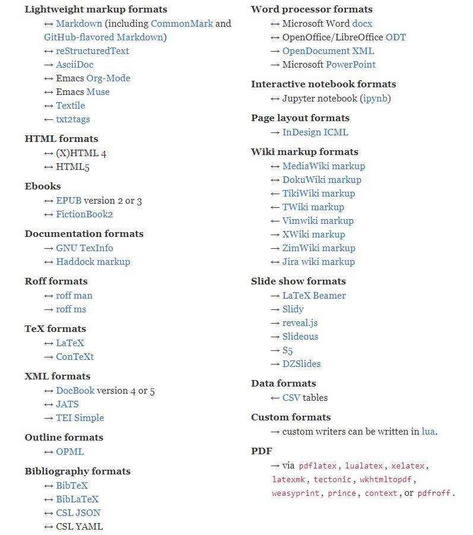
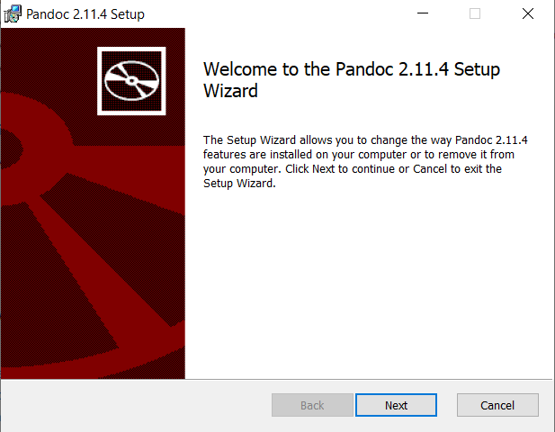
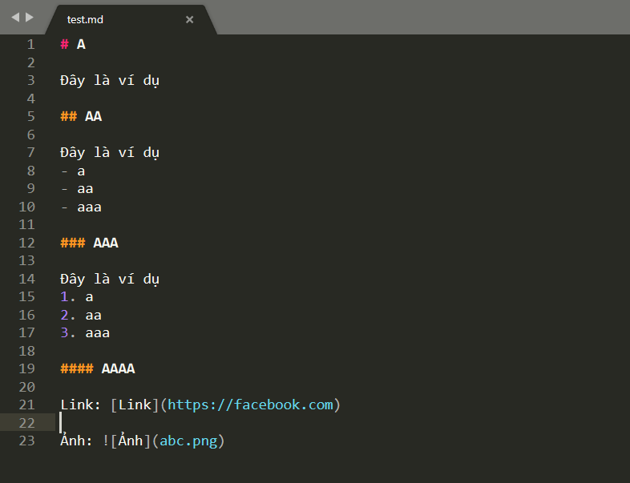
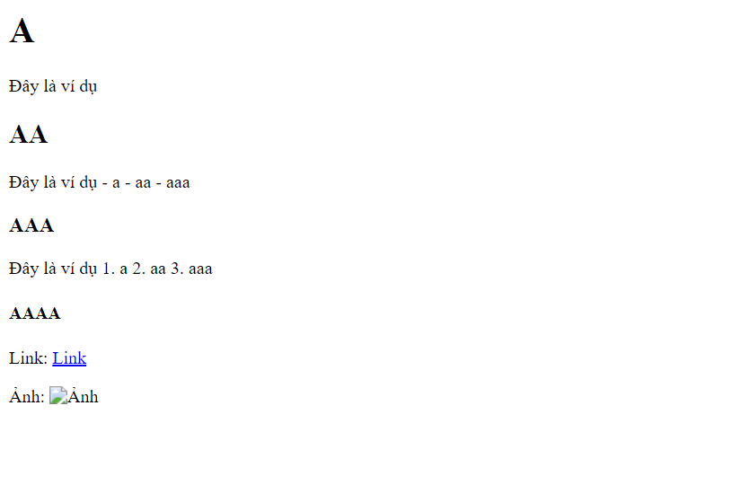

## Pandoc là gì?

Pandoc là một trình chuyển đổi tài liệu miễn phí và mã nguồn mở, được sử dụng rộng rãi như một công cụ viết. Pandoc tự gọi mình là trình chuyển đổi "định dạng đánh dấu". Nó có thể lấy một tài liệu ở một trong các định dạng được hỗ trợ và chỉ chuyển đổi đánh dấu của nó sang định dạng khác. Tuy nhiên, việc duy trì giao diện của tài liệu không phải là ưu tiên hàng đầu của Pandoc.

Bạn có thể sử dụng pandoc trên Linux để chuyển hơn 40 định dạng file khác nhau. Dưới đây là một số định dạng được hỗ trợ:

<p align="center">

</p>

**Lưu ý:** Chiều mũi tên ($\leftarrow$ = chuyển đổi từ; $\rightarrow$ = chuyển đổi sang; $\leftrightarrow$ = chuyển đổi từ và sang).

Ví dụ: $\leftrightarrow$ Markdown tức là bạn có thể chuyển các định dạng khác sang Markdown và ngược lại.

## Cài đặt Pandoc

#### Đối với Windows

1. Tải về bản cài đặt mới nhất: 
    - [Pandoc cho 64 bit](https://github.com/jgm/pandoc/releases/download/2.11.4/pandoc-2.11.4-windows-x86_64.msi).
    - [Source code](https://github.com/jgm/pandoc/archive/2.11.4.zip).

2. Tiền hành cài đặt theo hướng dẫn

    <p align="center">
       
    </p>

3. Nhấn **Finish** để hoàn tất cài đặt.

#### Đối với Linux

##### Ubuntu

Để cài đặt pandoc trên Ubuntu, dùng lệnh:

```
    sudo apt-get install pandoc
```

##### Fedora

Trên Fedora, dùng lệnh:

```
    sudo dnf install pandoc
```

##### Manjaro

Trên Manjaro, dùng lệnh:

```
    sudo pacman -Syu pandoc
```

Lưu ý: Để kiểm tra phiên bản nào đã cài đặt, sử dụng câu lệnh:

```
    pandoc --version
```

## Cách sử dụng Pandoc

### Chuyển đổi định dạng tự động

Việc chuyển đổi tập tin rất đơn giản với Pandoc. Pandoc thường có thể tìm ra định dạng tệp mà bạn làm việc cùng. Ví dụ ở đây sẽ tạo một tệp **HTML** từ **Markdown**. Tùy chọn **-o** (đầu ra) cho Pandoc biết tên của tệp mà chúng ta muốn tạo:

```
    pandoc -o test.html test.md
```

Tệp Markdown mẫu, test.md, chứa ví dụ ngắn của Markdown được hiển thị trong hình bên dưới.

<p align="center">
    
    <caption>Tệp test.md</caption>  
</p>

Một tệp có tên test.html được tạo. Khi click đúp vào tệp, trình duyệt mặc định sẽ mở nó.

<p align="center">
      
    <caption>Tệp test.html</caption>
</p>